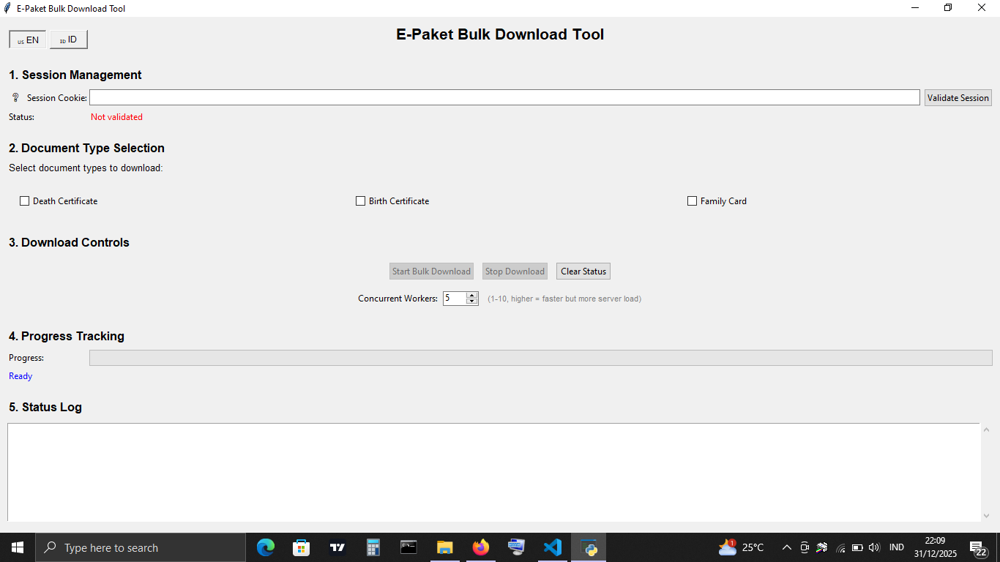
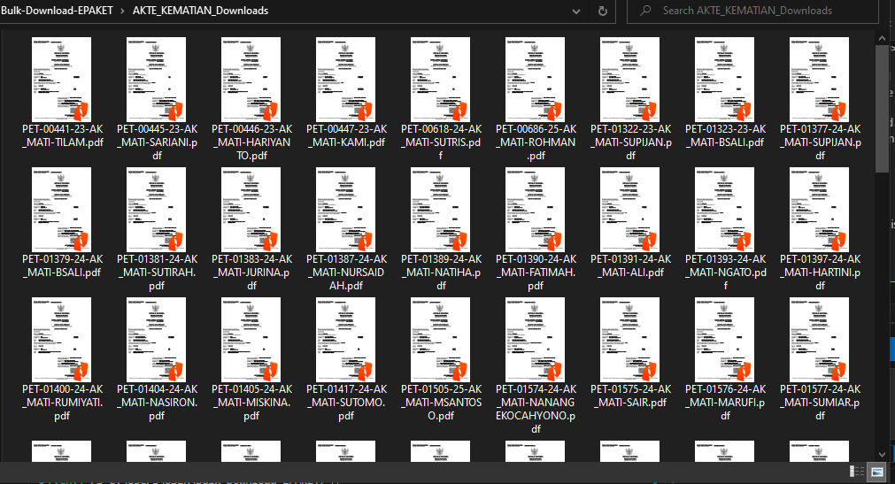

# 🛑 Authorized Use Only
**WARNING: Access to this system is restricted to authorized users only. Unauthorized access, use, or modification of this system or the data contained herein is strictly prohibited and may be subject to criminal and civil penalties.**

# E-Paket Bulk Download Tool

[](https://www.python.org/downloads/)
[](LICENSE)

A powerful, user-friendly GUI application for bulk downloading civil registration documents (Death Certificates, Birth Certificates, and Family Cards) from the E-Paket system. Built with speed and efficiency in mind, featuring concurrent processing and multi-language support.

## 🖼️ Screenshots

### Main GUI Interface


*The clean interface with language selection, session management, document selection, and progress tracking*

### Results  


*PDF files result in explorer*

## ✨ Features

- 🖥️ **Modern GUI Interface** - Clean, intuitive desktop application.
- ⚡ **Concurrent Downloading** - Uses `ThreadPoolExecutor` for 5x-10x faster downloads.
- 🌐 **Bilingual Support** - Switch between English (🇺🇸) and Indonesian (🇮🇩) instantly.
- ⚙️ **Configurable Workers** - Adjust processing power (1-10 workers) based on your needs.
- 🔍 **Smart Filtering** - Select specific document types (Akte Kematian, Akte Kelahiran, Kartu Keluarga).
- 🚫 **Duplicate Detection** - Automatically skips files already present on your disk.
- 📊 **Real-time Status Log** - Detailed activity monitoring and progress tracking.

## 🛠️ Mechanism

The application utilizes a **Concurrent Processing Model**:
1. **Session-Based Authentication**: Uses your browser's session cookie (`ci_session`) to authenticate requests.
2. **Parallel Task Execution**: Leverages Python's `ThreadPoolExecutor` to handle multiple package scans simultaneously. Instead of checking one package at a time, the tool can check up to 10 packages in parallel.
3. **Optimized API Access**: Directly interacts with the server's AJAX endpoints, bypassing slow webpage rendering and saving significant bandwidth.

## 📖 Glossary

| Term | Format | Description |
|------|--------|-------------|
| **Package Code** | `PET-{NUMBER}-{YEAR}` | The unique identifier for a submission. |
| **PET** | Prefix | Indicates a "Permohonan" (Submission/Request). |
| **NUMBER** | `15456` | A sequential unique integer identifying the submission. |
| **YEAR** | `25` | Two-digit representation of the submission year (e.g., `25` for 2025). |

## 📋 Prerequisites

- Python 3.8 or higher
- Access to the E-Paket system
- Valid login credentials

## 🚀 Quick Start

### 1. Install Dependencies

```bash
pip install -r requirements.txt
```

### 2. Run the Application

```bash
python gui_bulk_download.py
```

### 3. Basic Usage Guide

1. **Select Language**: Click the language button (top-left) for English or Indonesian.
2. **Setup Session**: 
   - Login to E-Paket in your browser.
   - Open DevTools (F12) -> Network -> Copy `ci_session` value from any request's Cookie header.
   - Click the ❓ icon in the app for a detailed visual guide.
3. **Configure Speed**: Adjust the "Concurrent Workers" slider. **Recommended: 5 workers**.
4. **Choose Documents**: Check the boxes for the documents. **Start**: you need.
5 Click "Validate Session" then "Start Bulk Download".

## 📋 Detailed GUI Guide

### Step 1: Get Your Session Cookie

1. Open your browser and log into the E-Paket system
2. Press **F12** to open Developer Tools
3. Go to the **Network** tab
4. Refresh the page
5. Click on any request to the server
6. Find the **Cookie** header in the request headers
7. Copy the `ci_session` value (e.g., `ci_session=abc123xyz...`)

### Step 2: Validate Session

1. Open the GUI application
2. Paste your session cookie in the "Session Cookie" field
3. Click "Validate Session"
4. Wait for the green "✓ Session valid" message

### Step 3: Select Document Types

Choose which documents to download:
- ☑️ **Akte Kematian** (Death Certificates)
- ☑️ **Akte Kelahiran** (Birth Certificates)
- ☑️ **Kartu Keluarga** (Family Cards)

### Step 4: Start Download

1. Click "Start Bulk Download"
2. Confirm the download in the popup dialog
3. Monitor progress in real-time
4. View detailed status in the log area

### Step 5: Monitor Progress

- **Progress Bar**: Visual progress indicator
- **Status Log**: Detailed timestamped messages
- **Color Coding**: 
  - 🟢 Green: Success
  - 🟠 Orange: Warning
  - 🔴 Red: Error
  - ⚫ Black: Info

## 📁 Download Organization

Documents are organized by type in separate folders:

```
Project Directory/
├── AKTE_KEMATIAN_Downloads/     # Death certificates
├── AKTE_KELAHIRAN_Downloads/    # Birth certificates
└── KARTU_KELUARGA_Downloads/    # Family cards
```

## 🔧 Interface Sections

### 1. Session Management
- Session cookie input field
- Validate Session button
- Session status indicator

### 2. Document Type Selection
- Checkboxes for each document type
- Multi-selection support

### 3. Download Controls
- Start Bulk Download button
- Stop Download button
- Clear Status button

### 4. Progress Tracking
- Progress bar with percentage
- Current package information
- Real-time updates

### 5. Status Log
- Scrolling text area
- Timestamped messages
- Color-coded by severity

### 6. Help Section
- Step-by-step instructions
- How to get session cookie guide

## 🗂️ Project Structure

- `gui_bulk_download.py`: The main GUI application script.
- `enhanced_downloader.py`: Core logic for concurrent document processing.
- `session_validator.py`: Handles verification of session integrity.
- `backup_project.py`: Helper script to create minimal backups of the core application.
- `requirements.txt`: Python package dependencies.
- `Downloads/`: Automatically created folders for each document type (e.g., `Akte_Kematian_Downloads`).

## ⚙️ Performance Table

| Method | Speed | Recommended Workers |
|--------|-------|---------------------|
| Sequential (v1) | ~1.5s per package | N/A |
| **Concurrent (v2)** | **~0.2s per package** | **5** |

*Note: For 500 packages, the concurrent version saves approximately 10 minutes of wait time.*

## ⚠️ Important Notes

### Session Management
- Session cookies expire after inactivity
- Always validate session before starting downloads
- Re-validate if you encounter errors

### Download Behavior
- Already downloaded files are skipped automatically
- Downloads are organized by document type
- Stop button immediately halts the process

### Error Handling
- Connection errors are displayed in red
- Failed downloads are logged with details
- Application continues processing other packages

## 🐛 Troubleshooting

### Session Validation Failed
- **Check cookie format**: Ensure it starts with `ci_session=`
- **Verify expiration**: Session may have expired
- **Re-login**: Get a fresh session cookie

### Download Errors
- **Network issues**: Check internet connection
- **Server errors**: Try again later
- **Permission issues**: Verify account access

### GUI Issues
- **Window not responsive**: Download in progress, wait or stop
- **Progress not updating**: Check network connectivity
- **Buttons disabled**: Complete previous steps first

## 🔄 Workflow Summary

```
1. Get Session Cookie → 2. Validate → 3. Select Documents → 4. Download → 5. Monitor
     ↓                    ↓              ↓                    ↓            ↓
  Browser DevTools    GUI Validation   Checkboxes         Start Button   Progress Log
```

## ⚠️ Security & Ethics

- **Confidentiality**: Never share your session cookie. It provides full access to your registration data.
- **Ethics**: Avoid setting workers above 10 to maintain system stability for other users.
- **Compliance**: This tool is for personal data retrieval. Do not use for unauthorized mass data scraping.

## 🤝 Support

If you encounter issues:

1. Check the status log for error messages
2. Verify your session cookie is valid
3. Try stopping and restarting the download
4. Check network connectivity
5. Contact support with error details

## 📝 License

This project is licensed under the MIT License.

---
**Made with ❤️ for E-Paket users**
